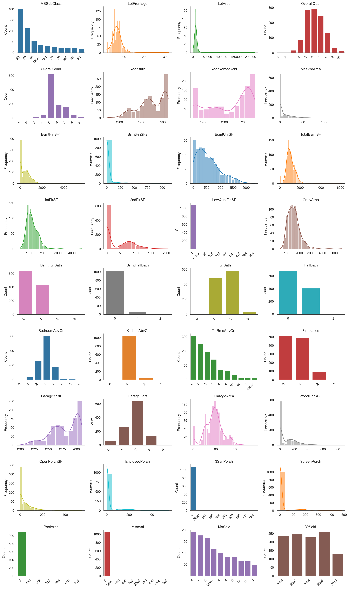
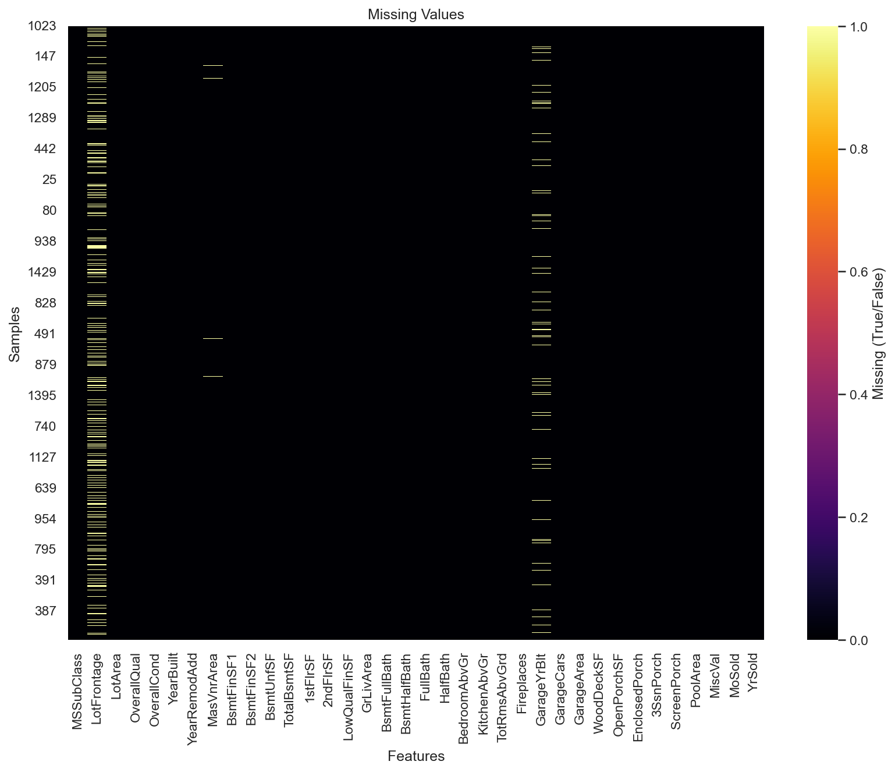
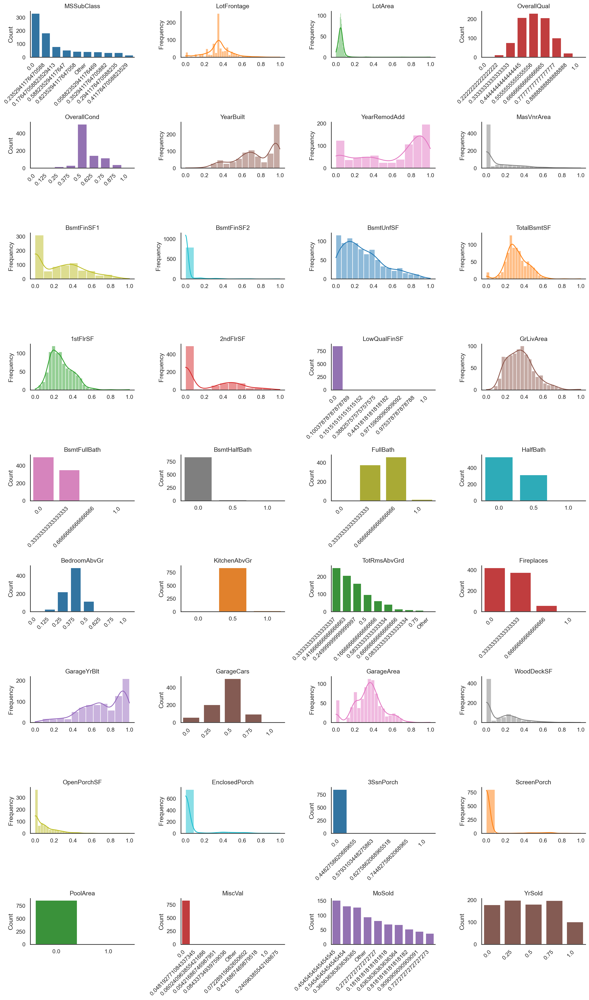
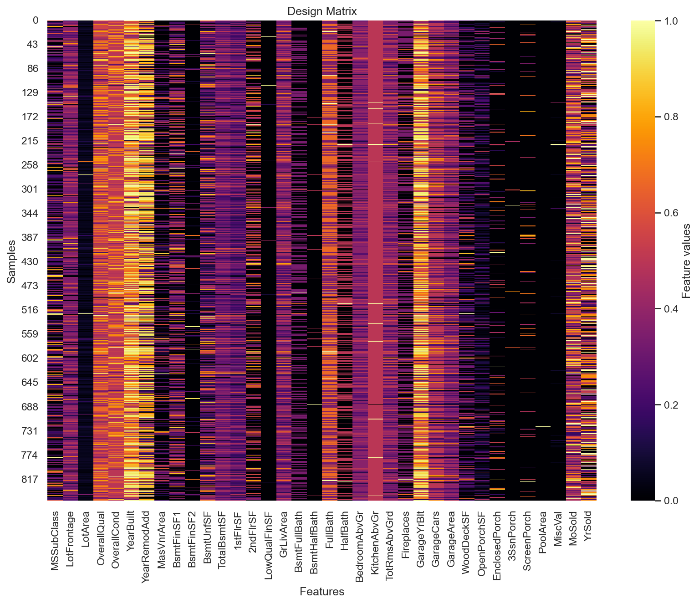
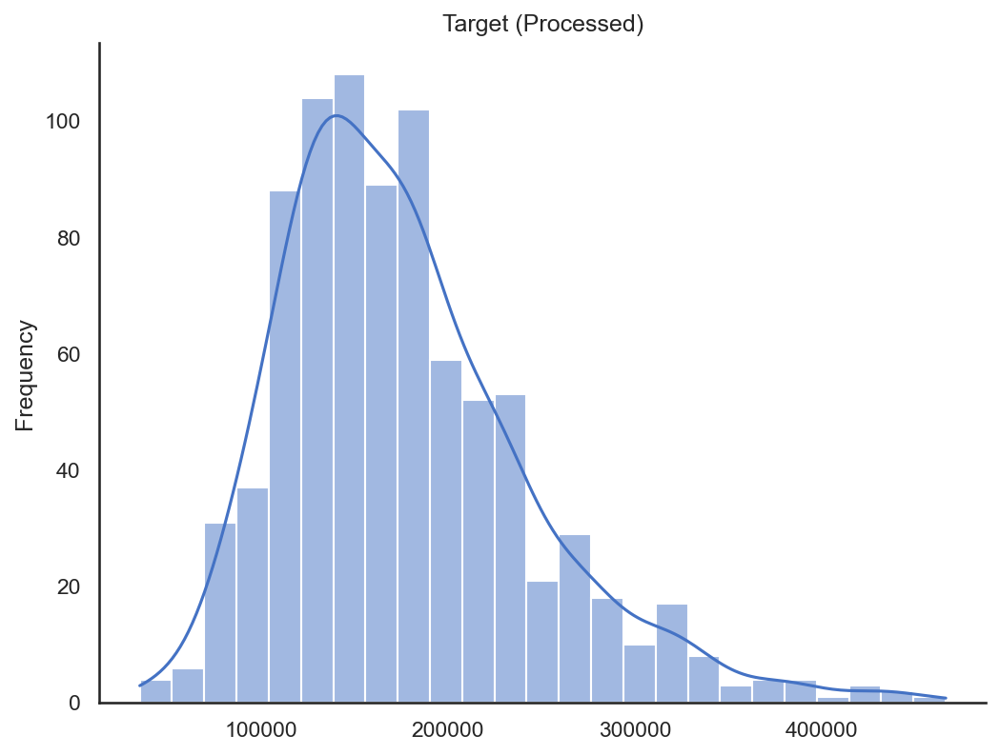
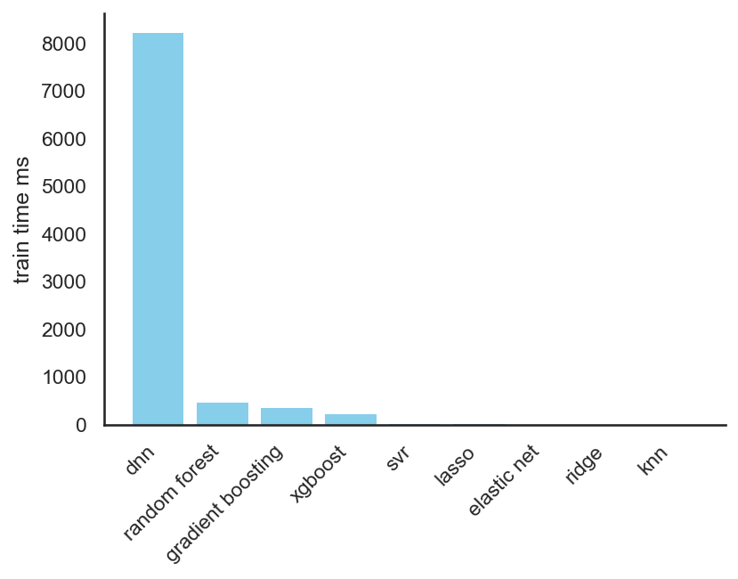
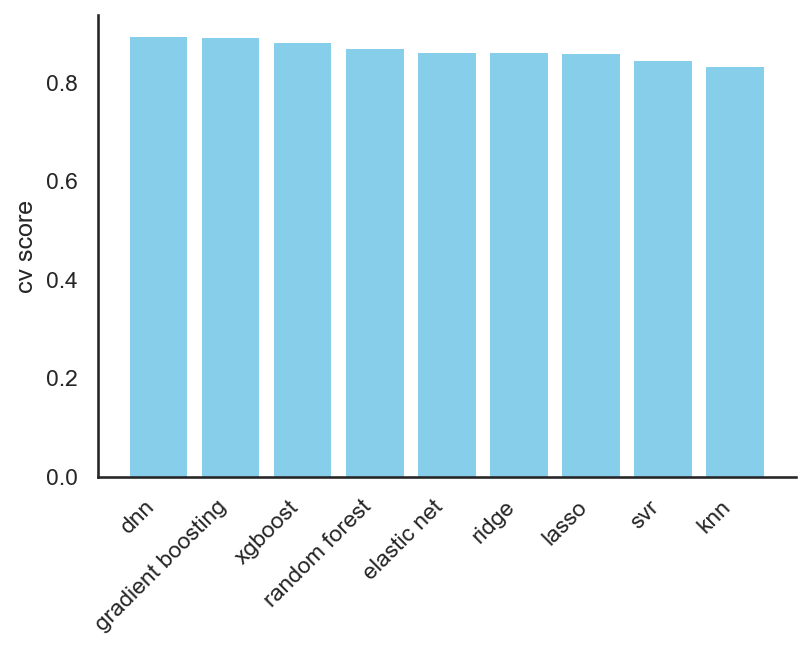
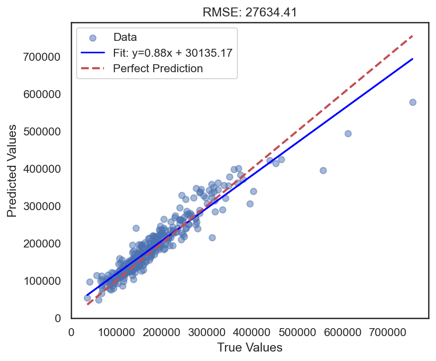
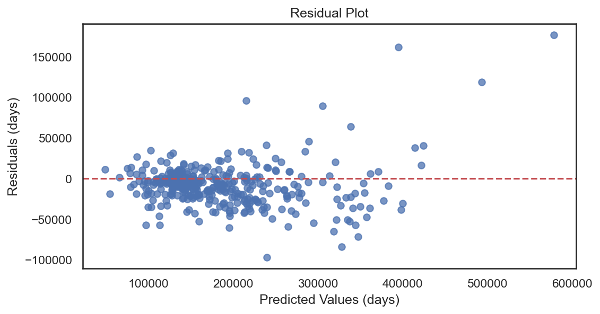

# Data Analysis Report v0001
Generated on: [date and time]

## Pre-Processing Analysis

### Dataset Overview
- **Number of samples**: 1,095
- **Number of features**: 36
- **Numeric features**: 36
- **Categorical features**: 0

### Original Feature Names
- **Total features**: 36
- **First 10**: `MSSubClass`, `LotFrontage`, `LotArea`, `OverallQual`, `OverallCond`, `YearBuilt`, `YearRemodAdd`, `MasVnrArea`, `BsmtFinSF1`, `BsmtFinSF2`
- **Last 10**: `GarageArea`, `WoodDeckSF`, `OpenPorchSF`, `EnclosedPorch`, `3SsnPorch`, `ScreenPorch`, `PoolArea`, `MiscVal`, `MoSold`, `YrSold`

### Target Variable
- **Data type**: int64
- **Unique values**: 548

### Missing Values
- **Total missing values**: 262
- **Missing values by feature**:
  - LotFrontage: 200 (18.26%)
  - MasVnrArea: 4 (0.37%)
  - GarageYrBlt: 58 (5.30%)

### Outliers Analysis
- **Detection method**: zscore
- **Threshold**: 3.0
- **Total outliers detected**: 241
- **Outlier percentage**: 22.01%

### Feature Distributions (Pre-processing)

### Target Distribution (Pre-processing)

### Missing Values Visualization

## Pipeline Configuration

### Preprocessing Settings
- **Task type**: regression
- **Remove outliers**: True
- **Outlier method**: zscore
- **Outlier threshold**: 3.0
- **Numerical imputation**: mean
- **Categorical imputation**: most_frequent
- **Categorical encoding**: onehot
- **Scaling method**: minmax
- **Target transformation**: none

### Model Training Settings
- **Scoring metric**: r2
- **Search type**: random
- **Number of iterations**: 30
- **Cross-validation folds**: 5

## Post-Processing Analysis

### Dataset Overview (After Processing)
- **Number of samples**: 854
- **Number of features**: 36
- **Samples removed**: 241 (22.01%)

### Transformed Feature Names
- **Total features**: 36
- **First 10**: `MSSubClass`, `LotFrontage`, `LotArea`, `OverallQual`, `OverallCond`, `YearBuilt`, `YearRemodAdd`, `MasVnrArea`, `BsmtFinSF1`, `BsmtFinSF2`
- **Last 10**: `GarageArea`, `WoodDeckSF`, `OpenPorchSF`, `EnclosedPorch`, `3SsnPorch`, `ScreenPorch`, `PoolArea`, `MiscVal`, `MoSold`, `YrSold`

### Feature Mapping
**Original → Transformed:**
*Mapping available for 36 original features*

### Feature Correlations (Post-processing)

### Feature Distributions (Post-processing)

### Design Matrix (Post-processing)

### Target Distribution (Post-processing)

## Best Model Results

### Model Information
- **Best model**: AutoHPSearchRegressor
- **Test score (r2)**: 0.8981

### Hyperparameters
- `activation`: relu
- `batch_size`: 16
- `dropout_rate`: 0.0
- `epochs`: 100
- `hidden_layers`: (256, 128, 64)
- `learning_rate`: 0.01
- `optimizer`: adam

### Model Variant Performance and Timing
### Training Time per Model Variant

### Cross-Validation Performance

### Test Set Analysis
### Regression Prediction Plot

### Regression Residuals Plot
