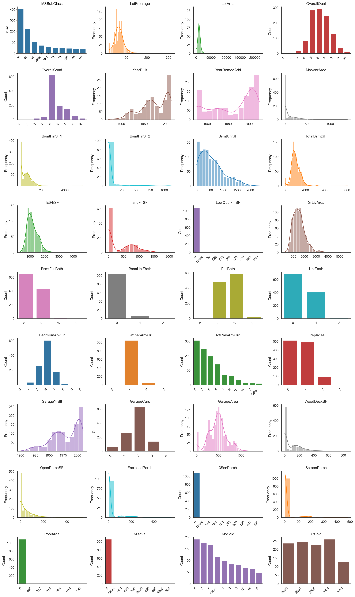
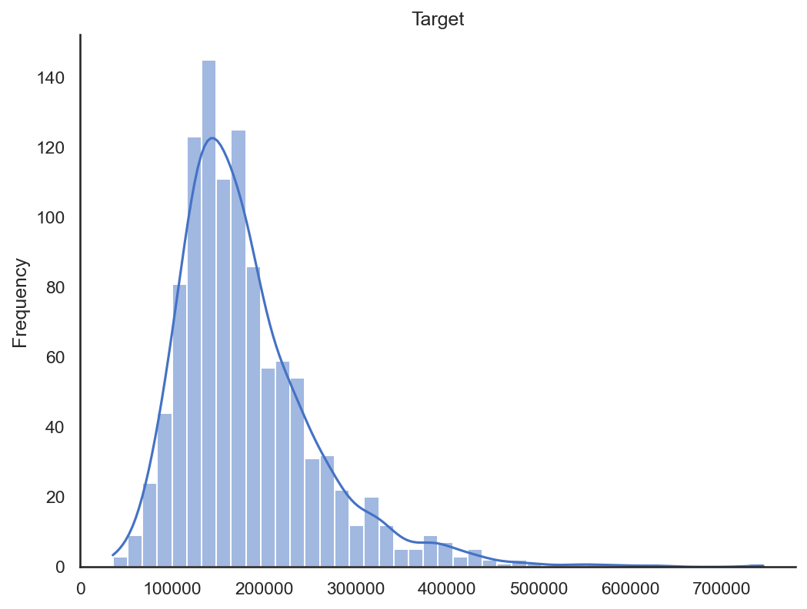
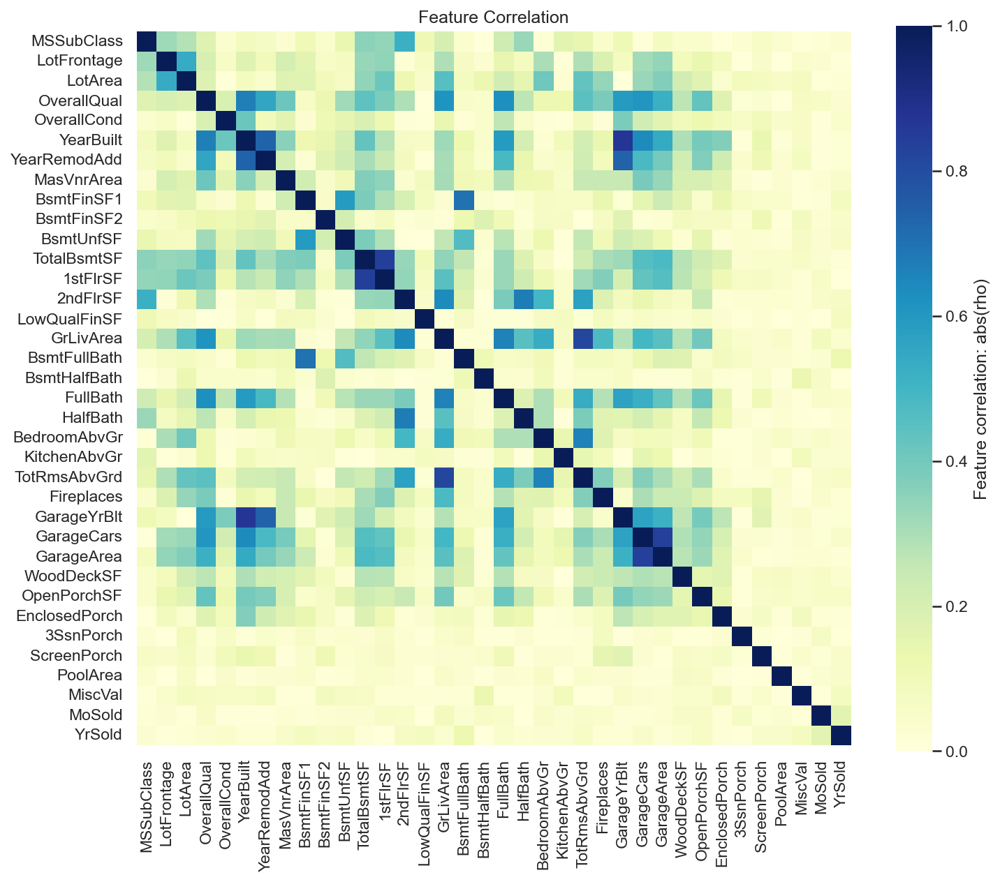
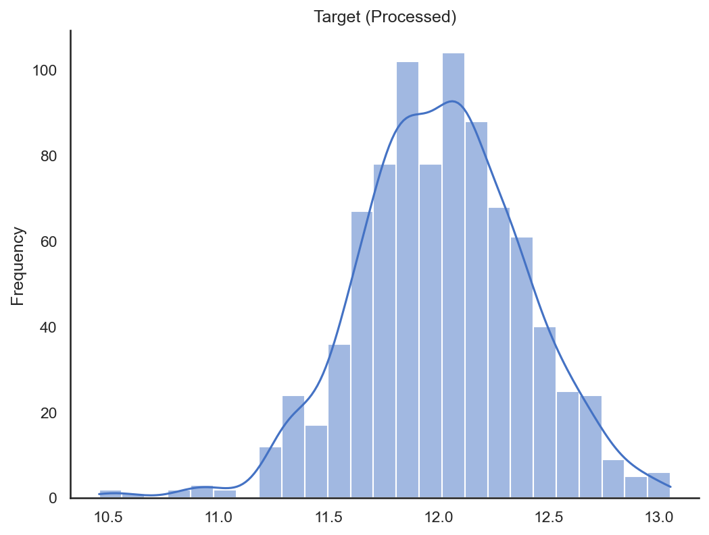
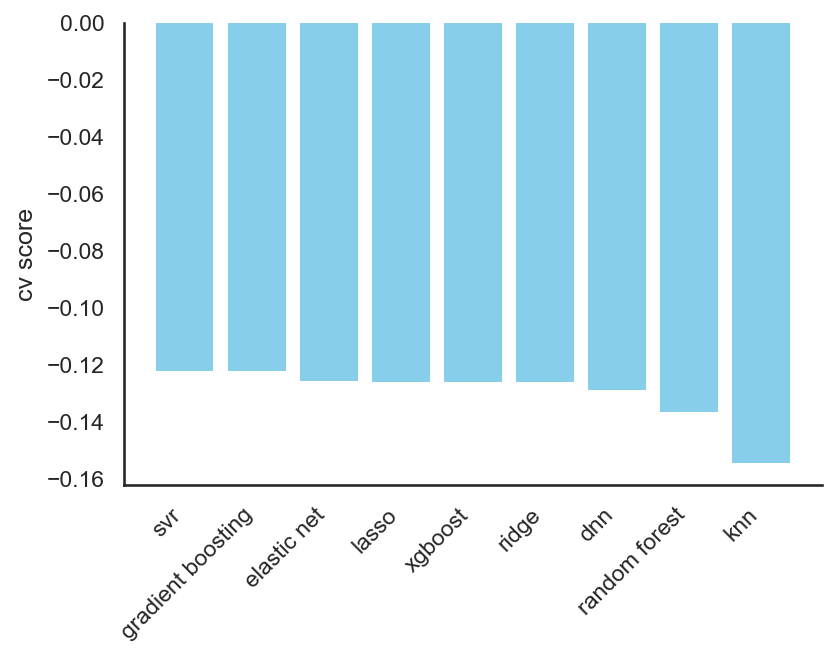
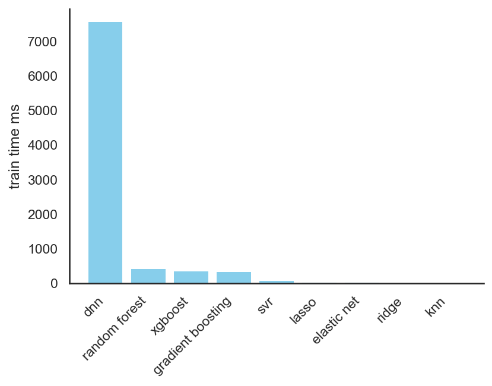
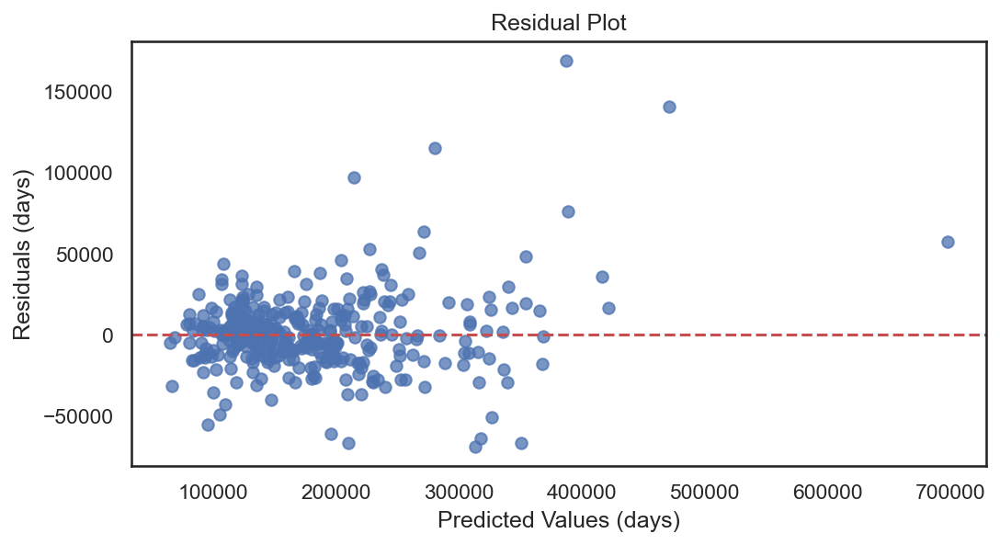

# Data Analysis Report v0001
Generated on: [date and time]

## Pre-Processing Analysis

### Dataset Overview
- **Number of samples**: 1,095
- **Number of features**: 36
- **Numeric features**: 36
- **Categorical features**: 0

### Original Feature Names
- **Total features**: 36
- **First 10**: `MSSubClass`, `LotFrontage`, `LotArea`, `OverallQual`, `OverallCond`, `YearBuilt`, `YearRemodAdd`, `MasVnrArea`, `BsmtFinSF1`, `BsmtFinSF2`
- **Last 10**: `GarageArea`, `WoodDeckSF`, `OpenPorchSF`, `EnclosedPorch`, `3SsnPorch`, `ScreenPorch`, `PoolArea`, `MiscVal`, `MoSold`, `YrSold`

### Target Variable
- **Data type**: int64
- **Unique values**: 548

### Missing Values
- **Total missing values**: 262
- **Missing values by feature**:
  - LotFrontage: 200 (18.26%)
  - MasVnrArea: 4 (0.37%)
  - GarageYrBlt: 58 (5.30%)

### Outliers Analysis
- **Detection method**: zscore
- **Threshold**: 3.0
- **Total outliers detected**: 241
- **Outlier percentage**: 22.01%

### Feature Distributions (Pre-processing)

### Target Distribution (Pre-processing)

### Missing Values Visualization

## Pipeline Configuration

### Preprocessing Settings
- **Task type**: regression
- **Remove outliers**: True
- **Outlier method**: zscore
- **Outlier threshold**: 3.0
- **Numerical imputation**: mean
- **Categorical imputation**: most_frequent
- **Categorical encoding**: onehot
- **Scaling method**: minmax
- **Target transformation**: log1p

### Model Training Settings
- **Scoring metric**: neg_root_mean_squared_error
- **Search type**: grid
- **Number of iterations**: 30
- **Cross-validation folds**: 5

## Post-Processing Analysis

### Dataset Overview (After Processing)
- **Number of samples**: 854
- **Number of features**: 36
- **Samples removed**: 241 (22.01%)

### Transformed Feature Names
- **Total features**: 36
- **First 10**: `MSSubClass`, `LotFrontage`, `LotArea`, `OverallQual`, `OverallCond`, `YearBuilt`, `YearRemodAdd`, `MasVnrArea`, `BsmtFinSF1`, `BsmtFinSF2`
- **Last 10**: `GarageArea`, `WoodDeckSF`, `OpenPorchSF`, `EnclosedPorch`, `3SsnPorch`, `ScreenPorch`, `PoolArea`, `MiscVal`, `MoSold`, `YrSold`

### Feature Mapping
**Original → Transformed:**
*Mapping available for 36 original features*

### Feature Correlations (Post-processing)

### Feature Distributions (Post-processing)

### Design Matrix (Post-processing)

### Target Distribution (Post-processing)

## Model Comparison

### Model Comparison Table

|                       |   cv_score |   test_score |   train_time_ms |   prediction_time_ms |
|:----------------------|-----------:|-------------:|----------------:|---------------------:|
| svr                   |    -0.1222 |      -0.1315 |         60.9863 |               0.1810 |
| gradient_boosting_reg |    -0.1223 |      -0.1358 |        316.6573 |               0.2856 |
| elastic_net           |    -0.1257 |      -0.1349 |          1.0004 |               0.0700 |
| lasso                 |    -0.1259 |      -0.1380 |          1.0014 |               0.0800 |
| xgboost_reg           |    -0.1261 |      -0.1365 |        335.9883 |               0.3235 |
| ridge                 |    -0.1262 |      -0.1354 |          0.0000 |               0.1007 |
| dnn_reg               |    -0.1288 |      -0.1547 |       7565.9151 |               0.4900 |
| random_forest_reg     |    -0.1366 |      -0.1532 |        403.8706 |               9.1234 |
| knn_reg               |    -0.1543 |      -0.1745 |          0.0000 |               6.8647 |

### Cross-Validation Performance

### Training Time per Model Variant

## Best Model Results

### Model Information
- **Best model**: SVR
- **Test score (neg_root_mean_squared_error)**: -0.1315

### Hyperparameters
- `C`: 100
- `cache_size`: 200
- `coef0`: 0.0
- `degree`: 2
- `epsilon`: 0.01
- `gamma`: 0.01
- `kernel`: rbf
- `max_iter`: -1
- `shrinking`: True
- `tol`: 0.001
- `verbose`: False

## Test Set Analysis
### Regression Prediction Plot

### Regression Residuals Plot
